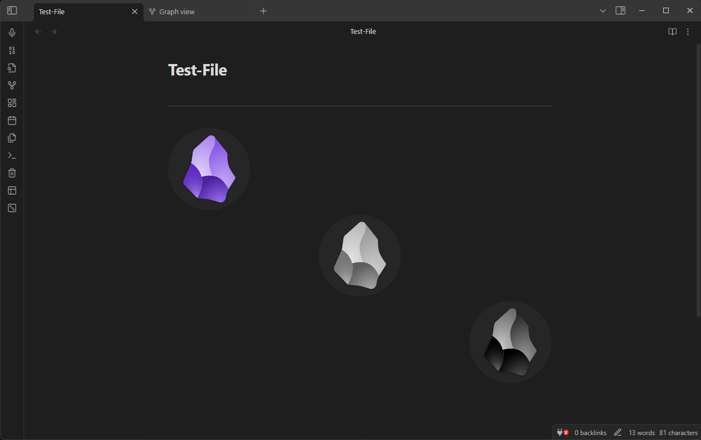

<p align="center">
  
</p>

<p align="center">
  <i><b>Custom CSS snippets for Obsidian.</b></i>
</p>

---

<h3 align="center">About CSS snippets</h3>

_CSS is a language to describe how to present a HTML document. By adding CSS snippets you can redefine parts of obsidian user interface, such as size and color of headings._

_Obsidian looks for CSS snippets inside vault configuration folder, usually a folder named `.obsidian`._

_To add a CSS snippet on Desktop, follow these steps —_

1. Open settings.
2. Under `Appearance` > `CSS snippets`, select `Open snippets folder` icon.
3. In the snippets folder, create/copy a CSS file that contains the snippet.
4. In Obsidian, under `Appearance` > `CSS snippets`, select `Reload snippets` icon to see the snippet in the list from where you can enable it.

_To add a CSS snippets on a Mobile/Tablet, you will need to follow these steps —_

1. Use the file manager to access the configuration folder and place the `snippet.css` in the snippet folder.

---

<h3 align="center"><u>Available CSS snippets</u></h3>

<section>
  <h4 align="center">
    <a href="./snippets/align-image.css">align-image.css</a>
  </h4>
  <ul>
    <li>Lets you specify the image position in alt text. Apply settings by using the following syntaxes —</li>
  </ul>

```
[[<image_file_name>|left]]
[[<image_file_name>|center]]
[[<image_file_name>|right]]
[[<image_file_name>|grid]]
```

  
</section>

<section>
  <h4 align="center">
    <a href="./snippets/custom-hr.css">custom-hr.css</a>
  </h4>
  <ul>
    <li>Adds a custom horizontal line with obsidian logo in the middle.</li>
  </ul>
  
</section>

<section>
  <h4 align="center">
    <a href="./snippets/graph-mod.css">graph-mod.css</a>
  </h4>
  <ul>
    <li>Adds a custom graph view theme.</li>
  </ul>
  
</section>

<section>
  <h4 align="center">
    <a href="./snippets/header-font.css">header-font.css</a>
  </h4>
  <ul>
    <li>Adds custom header font and header font colors.</li>
  </ul>
  
</section>

<section>
  <h4 align="center">
    <a href="./snippets/highlight-bg.css">highlight-bg.css</a>
  </h4>
  <ul>
    <li>Modifies the highlighted text background color to match the graph-mod's theme.</li>
  </ul>
  
</section>

<section>
  <h4 align="center">
    <a href="./snippets/lucide-buttons.css">lucide-buttons.css</a>
  </h4>
  <ul>
    <li>Modifies the titlebar buttons.</li>
  </ul>
  
</section>

<section>
  <h4 align="center">
    <a href="./snippets/new-tab-mod.css">new-tab-mod.css</a>
  </h4>
  <ul>
    <li>Adds an 🪨 obsidian logo in the empty tab.</li>
  </ul>
  
</section>

<section>
  <h4 align="center">
    <a href="./snippets/table-mod.css">table-mod.css</a>
  </h4>
  <ul>
    <li>The table takes up 100% of the width even if there is only a single column.</li>
    <li>Adds border radius to every table cell and adds a 2px spacing between them (optional).</li>
  </ul>
  
  <ul>
    <li>The spacing can be easily removed by uncommenting the following part of the CSS snippet —</li>
  </ul>

```
. . .

/* Uncomment the lines below to remove border spacing and combine all table boxes together */

/* === erase this line to uncomment === //

:root table {border-spacing: 0;}
tr td, tr th {border-radius: 0;}
th:first-child {border-top-left-radius: var(--table-border-radius);}
th:last-child {border-top-right-radius: var(--table-border-radius);}
tr:last-child td:first-child {border-bottom-left-radius: var(--table-border-radius);}
tr:last-child td:last-child {border-bottom-right-radius: var(--table-border-radius);}
:root :is(td, th) {border-width: 0 var(--table-border-width) var(--table-border-width) 0;}

/* */
```

  <ul>
    <li>Now the table will look like this —</li>
  </ul>
  
</section>

---
